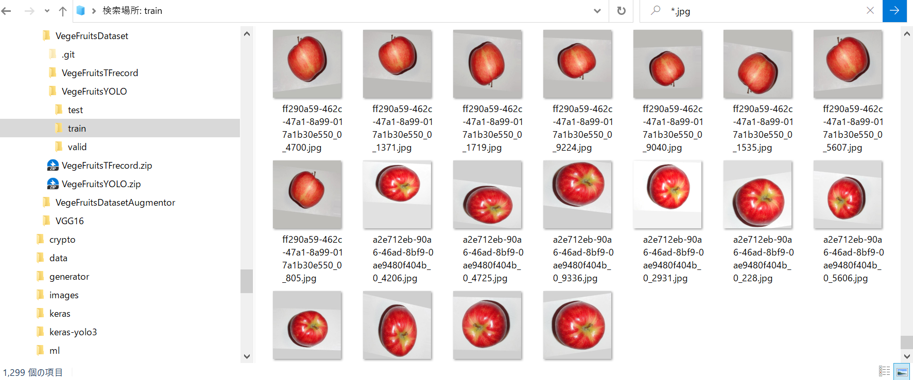
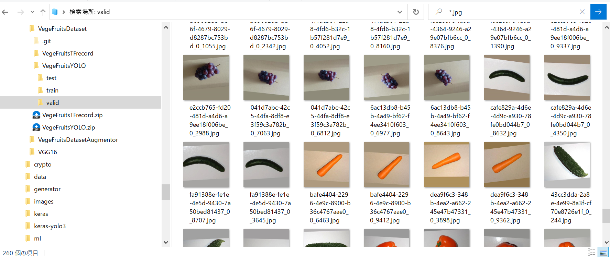
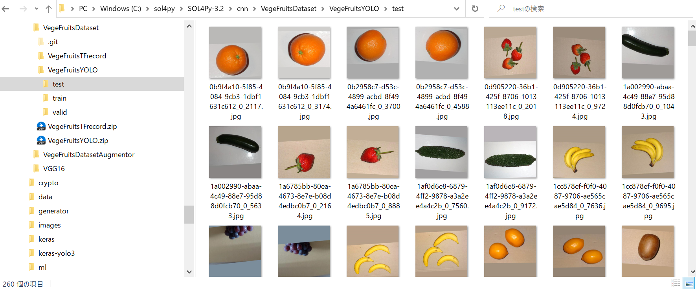

# VegeFruitsDataset
<h2>VegeFruits Dataset - YOLO and TFRecord</h2> 

This is a tiny dataset on VegeFruits. 
We have the following two annotated dataset for object detection: 
 
・<a href="./VegeFruitsYOLO">VegeFruitsYOLO</a>  
・<a href="./VegeFruitsTFRecord">VegeFruitsTFRecord </a>  
 

The dataset contains following classes. 
<pre>
apple
banana
bell_pepper
bitter_gourd
carrot
cucumber
grape
kiwi
lemon
orange
strawberry
zucchini
</pre>
 
Sample images in ./VegeFruitsYOLOL/train folder: 
 

 
 

Sample images in ./VegeFruitsYOLOL/valid folder: 
 

 
 

Sample images in ./VegeFruitsYOLOL/test folder: 
 

 
 
